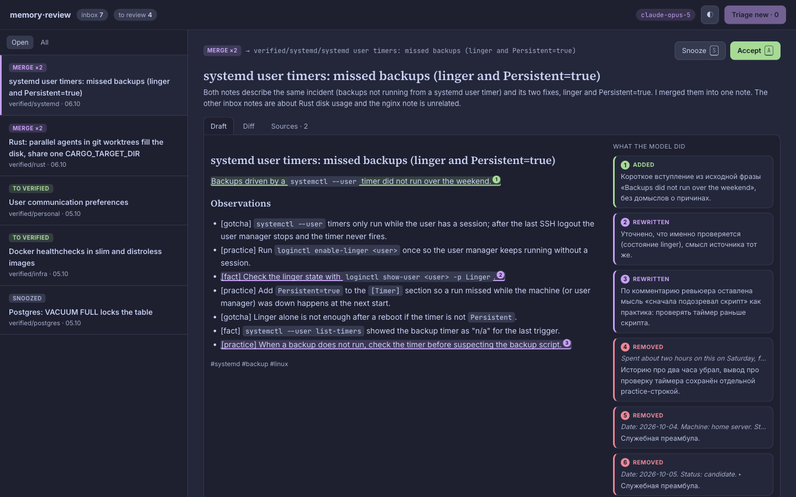
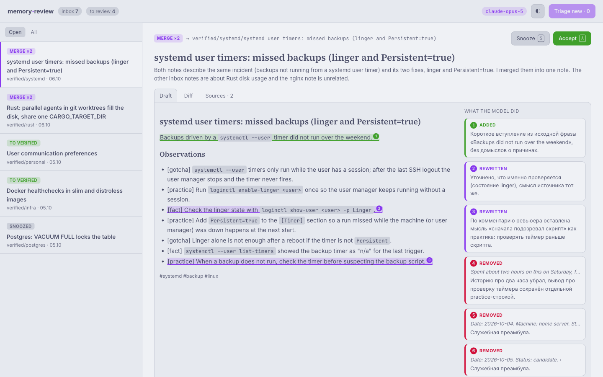

# memory-review

A review queue for the shared memory of AI coding agents.

Agents (Claude Code, Codex, OpenCode, …) write what they learn into an `inbox/` folder of a
[Basic Memory](https://github.com/basicmachines-co/basic-memory) knowledge base. Only notes a
human has reviewed move to `verified/`, and only those count as trusted knowledge. Reviewing
dozens of notes by hand is tedious, so they pile up.

memory-review turns the inbox into a queue. For each note an LLM agent prepares a proposal:
**promote** it, **merge** it with related notes, or **delete** it, together with a cleaned-up
draft and a short rationale. You read the diff, comment if something is off, the agent revises,
and you accept. Accepting writes the draft to `verified/` and removes the inbox notes.





## How it works

- **The agent only runs when you press a button.** “Triage new” prepares proposals for inbox
  notes that have none; “Send to agent” delivers your comments on a card. There is no timer.
- **Comments are asynchronous**, like a code review: leave several, send them together, the
  answer and a new draft version appear in the thread.
- **The draft explains itself.** The agent lists every meaningful change it made — added,
  rewritten, removed — with a one-line reason. The draft view highlights those fragments and
  shows the reasons in the margin (a summary above the text on narrow screens); the diff is
  one tab away.
- **Comment on exactly what you mean.** Select a fragment of the draft (or press `C` with a
  selection) or click 💬 on a diff line; the agent gets the quote together with your comment.
- **The model is a setting.** The header shows the model in use; `/settings` lists the models
  the endpoint offers to your key and switches without a restart. The endpoint and key stay in
  the environment.
- **Only “Accept” writes to the vault.** The agent has read-only access to memory. Accept
  writes the verified note first, then deletes the sources; if anything fails half-way, the card
  stays in *applying* and “Retry” finishes the job without duplicating work.
- **Edits made elsewhere are respected.** If a source note changes after the draft was made
  (for example in Obsidian), the card turns *stale* and nothing is written until you regenerate.
- Memory is accessed through the Basic Memory MCP server (streamable HTTP). The model is any
  OpenAI-compatible chat completions endpoint that supports tool calls.

## Run

```sh
docker compose -f docker-compose.example.yml up -d --build
```

**memory-review has no login of its own.** Run it only behind a reverse proxy that
authenticates users (Authentik forward auth, oauth2-proxy, basic auth). State-changing requests
must carry an `Origin` header equal to `MR_PUBLIC_ORIGIN`, which blocks cross-site requests
riding on the proxy's session cookie.

## Configuration

| Variable | Required | Default | Meaning |
|---|---|---|---|
| `MR_MCP_URL` | yes | | Basic Memory MCP endpoint, e.g. `http://basic-memory:8000/mcp` |
| `MR_PROJECT` | yes | | Basic Memory project name |
| `MR_LLM_URL` | yes | | Base URL of an OpenAI-compatible API (`/v1/chat/completions` is appended) |
| `MR_LLM_KEY` | yes | | API key for it |
| `MR_MODEL` | yes | | Default model; the settings page overrides it |
| `MR_PUBLIC_ORIGIN` | yes | | Origin the browser uses, e.g. `https://review.example.org` |
| `MR_LANG` | | `en` | Interface language: `en` or `ru` |
| `MR_INBOX_DIR` | | `inbox` | Folder agents write to |
| `MR_VERIFIED_DIR` | | `verified` | Folder for reviewed notes |
| `MR_SNOOZE_DAYS` | | `7` | How long “Snooze” hides a card |
| `MR_BIND` | | `0.0.0.0:8080` | Listen address |
| `MR_DB_PATH` | | `data/review.db` | SQLite file with cards and threads |
| `MR_PROMPTS_DIR` | | built in | Folder with `system.md`, `triage.md`, `reply.md` overriding the [built-in prompts](prompts/) |

## Keyboard

| Key | Action |
|---|---|
| `J` / `K` | Next / previous card |
| `A` | Accept (press twice) |
| `S` | Snooze |
| `R` | Regenerate a stale card |
| `C` | Comment on the selected draft fragment, or write a general comment |
| `⌘↵` / `Ctrl↵` | Send comments to the agent |

## Development

```sh
just ci      # fmt check, clippy -D warnings, tests, secret scan
just run
```

Rust stable, axum, askama, HTMX, SQLite. Fonts (Inter, Source Serif 4, JetBrains Mono) are
bundled under the SIL Open Font License; HTMX under 0BSD. The colour scheme is
[Catppuccin](https://catppuccin.com) Latte and Macchiato.

## License

MIT
